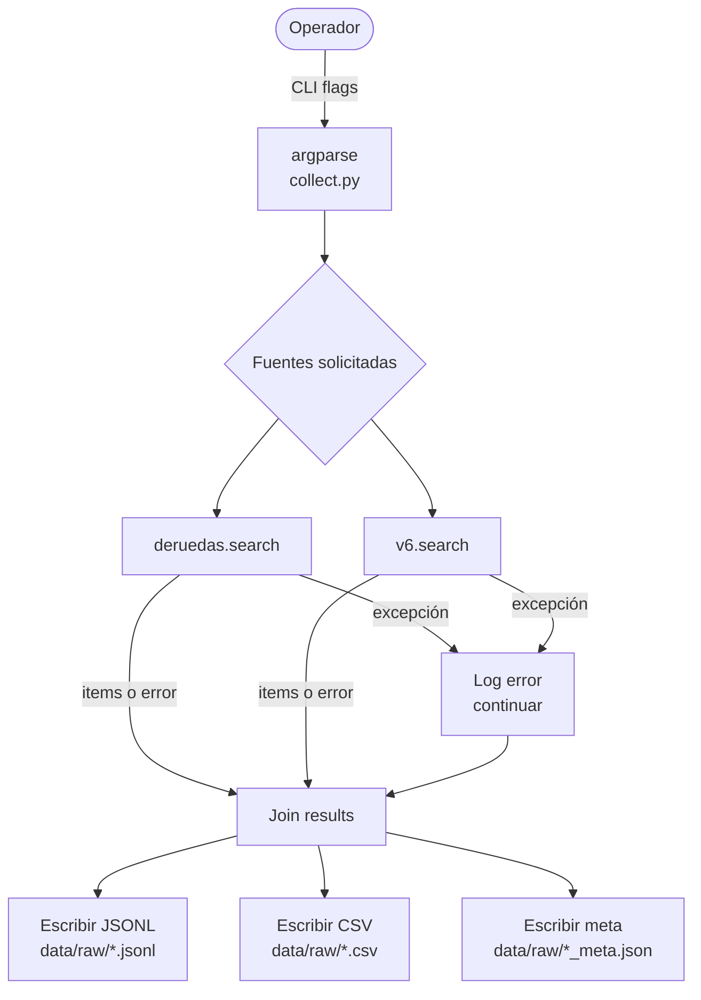

# Flujos de obtención de datos (Vehículos)

Documentación técnica para el equipo. Describe cómo el pipeline de ingestión descarga, extrae y normaliza avisos de vehículos de cada proveedor para alimentar el dataset de tasación.

- **Código fuente:** `src/ingest/`
- **CLI principal:** `python3 -m src.ingest.collect`
- **Ver también:** [`docs/obtencion-precios.md`](obtencion-precios.md)

---

## Índice

1. [Orquestador `collect`](#1-orquestador-collect)
2. [DeRuedas (Scraping)](#2-deruedas)
3. [V6 (Next.js API)](#3-v6)
4. [Esquema de fila (`VehicleListing`)](#4-esquema-de-fila-vehiclelisting)
5. [Aislamiento de errores](#5-aislamiento-de-errores)

---

## 1. Orquestador `collect`

**Archivo:** `src/ingest/collect.py`

`collect.py` actúa como director del pipeline: recibe los flags de búsqueda (marca y modelo), llama a los collectors de forma aislada y unifica los resultados en un dataset **Tidy**.

### Flags del CLI

| Flag | Obligatorio | Ejemplo |
|---|:---:|---|
| `--marca` | Sí | `Ford`, `Fiat`, `Hyundai` |
| `--modelo` | Sí | `Fiesta`, `Cronos`, `HB20` |
| `--limit` | No | `50` (tope por fuente; default: `50`) |
| `--sources` | No | `deruedas,v6` (default: ambas) |
| `--output` | No | `data/raw` (default) |

### Flujo general



### Archivos generados por corrida

```text
data/raw/{marca}_{modelo}_{YYYYMMDD}.csv
data/raw/{marca}_{modelo}_{YYYYMMDD}.jsonl
data/raw/{marca}_{modelo}_{YYYYMMDD}_meta.json
```

El archivo `_meta.json` informa la trazabilidad de la corrida:

```json
{
  "collected_at": "2026-08-24T00:50:00Z",
  "marca": "Fiat",
  "modelo": "Cronos",
  "sources_requested": [
    "deruedas",
    "v6"
  ],
  "rows": 52,
  "per_source_counts": {
    "deruedas": 50,
    "v6": 2
  },
  "per_source_errors": null
}
```

---

## 2. DeRuedas

**Archivo:** `src/ingest/collectors/deruedas.py`

**Método:** Scraping híbrido (**Microdatos Schema.org + HTML Parsing**).

### Estrategia de ingesta

1. **Buscador:** se genera la URL de búsqueda dinámica con los parámetros de marca y modelo.
2. **Listado:** se extraen las URLs de las fichas individuales.
3. **Ficha (detalle):** se realiza una petición por vehículo para obtener datos profundos:
   - **Microdatos:** se capturan etiquetas `itemprop` (`price`, `modelDate`, `mileageFromOdometer`) por ser la estructura más estable.
   - **Equipamiento:** se procesan los bloques `.box-destacado` para extraer Potencia (CV), Motor y Tracción.

### Normalización de DeRuedas

- **Kilometraje:** se elimina el texto `Km` y los puntos para convertir el valor a `int`.
- **Precio:** se detecta el símbolo `$` o `u$s` para asignar la moneda correspondiente.

---

## 3. V6

**Archivo:** `src/ingest/collectors/v6.py`

**Método:** Extracción de JSON hidratado (**Next.js Data**).

V6 es la fuente de **referencia técnica**. A diferencia del scraping HTML convencional, se extrae el estado interno de la aplicación web.

### Lógica de obtención

1. **Headers:** se inyectan `x-v6-country: ar`, `Origin` y `Referer` para evitar bloqueos `403`.
2. **Extracción:** se utiliza una expresión regular sobre el código fuente para capturar el objeto `initialVehicle`.
3. **Mapeo técnico:** se extraen variables de ingeniería difíciles de encontrar en otros portales:
   - `specs.mecanica.potencia_hp` — feature crítica para la tasación.
   - `specs.mecanica.torque_nm`.
   - `specs.mecanica.consumo_mixto_l_100km`.
4. **Trims:** si el vehículo es 0 km, se expande la lista de versiones (`trims`), creando una fila por cada una.

---

## 4. Esquema de fila (`VehicleListing`)

Definido en `src/ingest/schema.py`.

Cada fila del dataset representa un **aviso único normalizado**:

| Campo | Tipo | Descripción |
|---|---|---|
| `source` | `str` | Origen del dato (`deruedas` o `v6`) |
| `make` / `model` | `str` | Marca y modelo (ej.: Ford Fiesta) |
| `year` | `int` | Año de fabricación |
| `mileage` | `int` | Kilometraje acumulado (`0` para 0 km) |
| `power_hp` | `float` | Potencia real del motor |
| `torque_nm` | `float` | Torque / par motor |
| `transmission` | `str` | Tipo de caja (Manual / Automática) |
| `traction` | `str` | Tracción (FWD, RWD, 4x4) |
| `price` | `float` | Valor numérico limpio |
| `currency` | `str` | Moneda (`ARS` o `USD`) |
| `url` | `str` | Link a la publicación original |
| `collected_at` | `str` | Timestamp de la captura (ISO UTC) |

---

## 5. Aislamiento de errores

El orquestador garantiza que el pipeline sea **resiliente**. Cada fuente se ejecuta en un bloque independiente:

```mermaid
flowchart LR
    subgraph Corrida
        S1[deruedas.search] -->|OK| J[Join]
        S2[v6.search] -->|Excepción| E[Log + meta_error]
        E -->|items=[]| J
    end

    J --> W[Export Dataset]
```

Si el scraper de **DeRuedas** falla debido a un cambio de diseño en el sitio, el sistema todavía generará el dataset con los datos técnicos de **V6**, registrando el incidente en los metadatos de la corrida.

---

## Resumen

El pipeline implementa una estrategia de **ingesta híbrida y tolerante a fallos**:

- **DeRuedas:** aporta información del mercado real de vehículos usados.
- **V6:** aporta especificaciones técnicas detalladas y datos de vehículos 0 km.
- **`collect.py`:** coordina las fuentes y consolida los resultados.
- **`VehicleListing`:** define el esquema común de los datos.
- **Metadatos:** permiten realizar trazabilidad y registrar errores de cada corrida.

El resultado es un dataset homogéneo preparado para las siguientes etapas del proyecto: **EDA, modelado predictivo y construcción del tasador automatizado**.