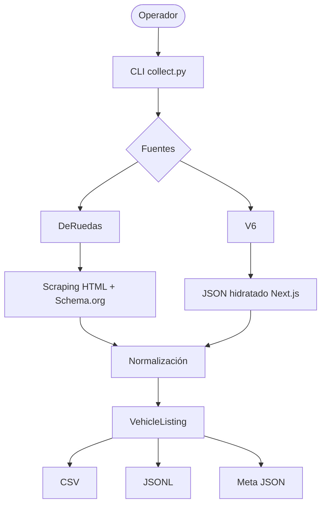

# Obtención de Datos: Tasación de Vehículos

## Propósito de esta capa

Preparar el dataset de **precios de mercado y especificaciones técnicas** para vehículos en Argentina (usados y 0 km), de forma que el resultado sea:

- **Público y reproducible:** cualquier persona con un clon del repositorio puede reconstruir el dataset consultando las fuentes en vivo.
- **Tidy (Criterio 1):** 1 vehículo publicado = 1 fila, 1 atributo técnico = 1 columna.
- **Rico en features:** a diferencia de un dataset de precios básico, esta capa captura variables de ingeniería como **Potencia (HP), Torque (Nm) y Tracción**, esenciales para un modelo de tasación preciso.
- **Sin datos privados:** se eliminan automáticamente teléfonos, emails o nombres de contacto del vendedor mediante el módulo de normalización.

### Pregunta de investigación

La pregunta de investigación se orienta a:

> **¿Cómo influyen las especificaciones técnicas de fábrica y el kilometraje en la curva de depreciación de los vehículos en el mercado local?**

---

## Fuentes implementadas en esta entrega

### 1. DeRuedas

**Archivo:** `src/ingest/collectors/deruedas.py`

- **Método:** scraping híbrido de HTML y microdatos (**Schema.org**).
- **Autenticación:** ninguna.

#### Rol en el proyecto

Provee la **"realidad del mercado"**. Es la fuente principal para capturar:

- Dispersión de precios en vehículos usados.
- Kilometraje.
- Año.
- Ubicación geográfica.
- Equipamiento destacado.
- Motor y potencia.

La fuente resulta especialmente relevante para el análisis de vehículos usados en **Mendoza y la región de Cuyo**.

#### Atributos capturados

- Kilometraje.
- Año.
- Precio de venta.
- Información sobre permutas.
- Equipamiento destacado.
- Motor.
- Potencia.

---

### 2. V6

**Archivo:** `src/ingest/collectors/v6.py`

- **Método:** extracción de JSON estructurado desde el estado hidratado de **Next.js** (`initialVehicle`).
- **Autenticación:** requiere headers de validación geográfica, incluyendo `x-v6-country: ar`.

#### Rol en el proyecto

Provee la **"verdad técnica"** y precios de referencia para vehículos **0 km**.

Permite obtener datos de ingeniería que los vendedores suelen omitir en los avisos comunes, por ejemplo:

- Torque exacto en Nm.
- Potencia.
- Consumo mixto.
- Tracción.
- Características de la transmisión.

#### Mapeo de versiones

Si un modelo posee múltiples versiones (**trims**), el collector expande automáticamente la respuesta para generar **una fila por cada variante técnica**.

Esto permite mantener el criterio:

> **1 variante publicada = 1 fila**

---

## Próximas fuentes — Siguiente fase

| Fuente | Método | Comentario |
|---|---|---|
| Mercado Libre | API / HTML | Mayor volumen de avisos a nivel nacional. |
| InfoAuto | Scraping | Referencia de precios de aseguradoras y concesionarios. |
| ACARA | PDF Parsing | Estadísticas oficiales de patentamientos para análisis de volumen. |

---

## Cómo ejecutar

### Desde la raíz del repositorio

#### 1. Instalar dependencias

```bash
python3 -m venv .venv
source .venv/bin/activate
```

En Windows:

```powershell
.venv\Scripts\activate
```

Instalar las dependencias:

```bash
pip install -r requirements.txt
```

#### 2. Obtener datos de Ford Mustang

Ejemplo para obtener datos de vehículos usados y referencias 0 km:

```bash
python3 -m src.ingest.collect \
    --marca Ford \
    --modelo Mustang \
    --limit 50
```

#### 3. Obtener datos de Fiat Cronos

Ejemplo con hasta 100 avisos por fuente:

```bash
python3 -m src.ingest.collect \
    --marca Fiat \
    --modelo Cronos \
    --limit 100
```

---

## Parámetros del CLI

| Parámetro | Obligatorio | Descripción |
|---|:---:|---|
| `--marca` | **Sí** | Nombre de la marca. Ej.: `"Ford"`, `"BMW"` |
| `--modelo` | **Sí** | Nombre del modelo. Ej.: `"Fiesta"`, `"Serie 1"` |
| `--limit` | No | Cantidad máxima de avisos por fuente. Default: `50` |
| `--sources` | No | Fuentes a ejecutar. Default: `"deruedas,v6"` |
| `--output` | No | Directorio de salida. Default: `"data/raw"` |

### Ejemplo utilizando una única fuente

Para ejecutar solamente DeRuedas:

```bash
python3 -m src.ingest.collect \
    --marca Ford \
    --modelo Fiesta \
    --limit 100 \
    --sources deruedas
```

Para ejecutar solamente V6:

```bash
python3 -m src.ingest.collect \
    --marca Ford \
    --modelo Fiesta \
    --limit 100 \
    --sources v6
```

---

## Archivos generados

Cada ejecución escribe los resultados en el directorio indicado mediante `--output`.

| Archivo | Descripción |
|---|---|
| `{marca}_{modelo}_{YYYYMMDD}.csv` | Dataset estructurado listo para análisis con Pandas. |
| `{marca}_{modelo}_{YYYYMMDD}.jsonl` | Registro crudo de los objetos extraídos, 1 objeto por línea. |
| `{marca}_{modelo}_{YYYYMMDD}_meta.json` | Estadísticas de la corrida: filas obtenidas y errores reportados. |

### Ejemplo de `meta.json`

```json
{
  "collected_at": "2026-08-24T10:30:00Z",
  "marca": "Ford",
  "modelo": "Fiesta",
  "sources_requested": [
    "deruedas",
    "v6"
  ],
  "rows": 58,
  "per_source_counts": {
    "deruedas": 50,
    "v6": 8
  },
  "per_source_errors": null
}
```

---

## Notas técnicas

### Consistencia numérica

El pipeline asegura que variables como `power_hp` y `mileage` sean valores numéricos puros.

Durante la normalización se eliminan sufijos y unidades como:

- `km`
- `cv`
- `HP`

Por ejemplo:

```text
"85.000 km" → 85000
"123 CV"    → 123.0
"150 HP"    → 150.0
```

Esto facilita posteriormente el procesamiento estadístico y el entrenamiento de modelos predictivos.

---

### Headers de seguridad

Para la fuente V6, el collector inyecta automáticamente headers como:

```text
x-v6-country: ar
Origin: ...
Referer: ...
```

Estos headers permiten realizar la solicitud con el contexto esperado por la aplicación y reducir el riesgo de bloqueos `403`.

---

### Rate limiting

Se incluye un retardo de **1 segundo** entre las descargas de fichas individuales de DeRuedas:

```python
sleep(1.0)
```

Esto busca:

- Reducir la carga sobre el servidor.
- Evitar solicitudes excesivamente rápidas.
- Garantizar mayor estabilidad durante la ingesta.
- Respetar las condiciones de acceso del sitio.

---

## Flujo general de obtención



---

## Objetivo de la capa

Esta capa establece la infraestructura necesaria para combinar **precios reales de mercado** con **características técnicas de fábrica**.

La combinación de ambas fuentes permitirá posteriormente analizar la relación entre:

- Precio.
- Año.
- Kilometraje.
- Potencia.
- Torque.
- Tracción.
- Transmisión.
- Combustible.
- Versión.

Estos datos servirán como base para las siguientes etapas del proyecto:

1. **Análisis exploratorio de datos (EDA).**
2. **Análisis de depreciación.**
3. **Selección y evaluación de features.**
4. **Modelado predictivo.**
5. **Construcción del sistema de tasación automatizada.**